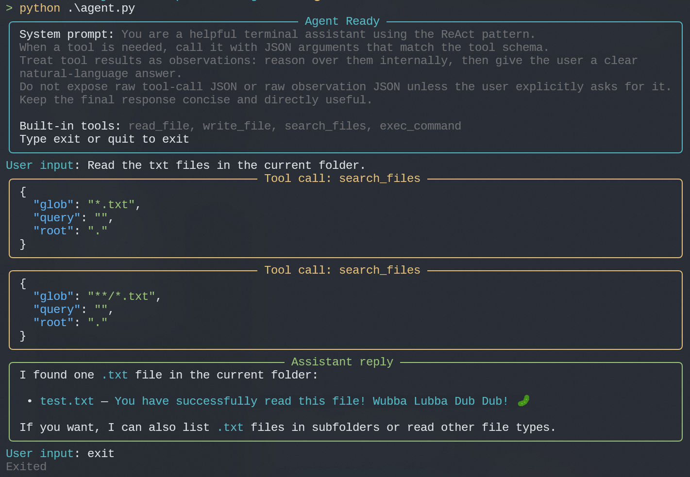

# DIY Your AI Agent

<p align="center">
   
   
   
</p>
<p align="center">
  <a href="./README_CN.md">中文文档</a> |
  <a href="https://deepwiki.com/whitejoce/DIY-your-AI-agent">deepwiki</a>
</p>

**This project is part of the [whitejoce/AI-Agent-Toolkit](https://github.com/whitejoce) stack, focusing on the Agent layer.**  
Full architecture: [RAG (Enterprise Knowledge Base)](https://github.com/whitejoce/RAG-Demo) → [Agent](https://github.com/whitejoce/DIY-your-AI-agent) → [Tool Runtime (Hot-reloadable MCP Tools Platform)](https://github.com/whitejoce/ToolFlow)


## 🔥 Project Overview
> Translated by GPT-5.5

A lightweight, framework-free AI Agent example. Built without LangChain or LangGraph, it prioritizes readability and simplicity to help you understand core Agent architecture.

<p align="center">
   
</p>

## Mini Agent

The MVP example in this repository lives in [`mini_agent/`](./mini_agent/).

- Usage guide: [mini_agent/README.md](./mini_agent/README.md)
- Entry point: `mini_agent/agent.py`
- Tool definitions: `mini_agent/tools.py`

## Project Structure

```text
.
├── requirements.txt    # Python dependencies
├── mini_agent/
│   ├── agent.py        # Agent loop: model calls, tool dispatch, terminal interaction
│   ├── tools.py        # Tool schemas and execution handlers
│   ├── README_*.md     # Documentation
│   └── .env.example    # Environment variable example
├── img/demo.png        # Demo screenshot
├── README_CN.md        # Chinese README
├── README.md           # English README
└── LICENSE
```

## Roadmap

Keep `Mini Agent` as the learning and testing base. A more complete version can gradually add the following modules:

- `ToolRegistry`: manage built-in tools, third-party tools, and MCP tools in one place.
- `ApprovalPolicy`: ask for user confirmation before high-risk actions such as writing files or running commands.
- `ContextManager`: manage short-term context, conversation compression, and token budgets.
- `Memory`: store long-term memory, user preferences, and project-level context.

## Safety Note

> This repository is better suited for learning the basic structure of Agents. For daily use, prefer mature community-maintained projects.

---

## 💡 Further Reading

### 1. Talk to a Frontier Model

- LLM APIs
   - OpenAI [Responses API](https://developers.openai.com/api/docs/guides/migrate-to-responses#about-the-responses-api) and `Chat Completions API`
   - Anthropic [Messages API](https://platform.claude.com/docs/zh-CN/build-with-claude/working-with-messages)
- [MCP](https://modelcontextprotocol.io/introduction), [Skills](https://developers.openai.com/api/docs/guides/skills), and progressive disclosure
   - Context engineering vs. harness engineering
   - Function calling and [Structured Outputs](https://developers.openai.com/api/docs/guides/structured-outputs)
- Agentic AI
   - Why are prompts becoming less central?
   - Observability and orchestration: logs, tool-call traces, error tracking, and performance monitoring
   - Human-in-the-loop workflows
- Benchmarks and evaluation
   - [Artificial Analysis](https://artificialanalysis.ai/models) and [Deep SWE benchmark](https://deepswe.datacurve.ai/)
- Multi-agent frameworks and SDKs
   - ADK: `A2A protocol` and `agent.json`
   - Design patterns behind frameworks such as LangGraph and LangChain
- LLM output quality
   - Metrics: accuracy, completeness, length, and reasoning path

### 2. Context Management Trade-offs

Recommended: [Claude Code's animated context-window demo](https://code.claude.com/docs/zh-CN/context-window).

- Short-term memory: select and preserve the most relevant information in the current conversation
   - What is the `dumb zone`?
   - Context compression: summarize earlier turns to save tokens while preserving continuity
- Long-term memory: retain user preferences, conversation history, and project context for better continuity
   - `AGENT.md` and `CLAUDE.md`: global and project-level context files
   - Memory systems: persist command history, user preferences, and related project facts
- External knowledge bases: Retrieval-Augmented Generation (RAG)

### 3. Explore Harness Design

> What is a harness, and why does it matter in agent design?

- [OpenClaw](https://github.com/openclaw/openclaw), [Hermes Agent](https://github.com/nousresearch/hermes-agent), [OpenHuman](https://github.com/tinyhumansai/openhuman), [Pi](https://pi.dev/)
- **Coding agents**: [Cursor](https://www.cursor.com/), [Codex](https://openai.com/codex), [Claude Code](https://code.claude.com/docs), [OpenCode](https://opencode.ai/)
   - Deep dive: understand how [Pi](https://github.com/earendil-works/pi) works

---

## 📜 License

This project is released under the **MIT License**. 

## 🤝 Contributions

Issues and PRs are welcome. 