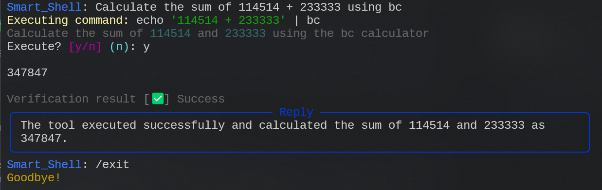

# DIY Your AI Agent: AI-powered Smart Terminal Assistant  

<p align="center">
  <a href="./README_CN.md">中文文档</a> |
  <a href="https://deepwiki.com/whitejoce/DIY-your-AI-agent">deepwiki</a> |
  <a href="https://github.com/whitejoce/mcp_agent">yet-another-mcp-implementation</a>
</p>

## 🔥 Project Overview

This project is a **Linux terminal Agent powered by LLMs**. It analyzes user input, decides whether a terminal command should be executed, and always returns the result in **JSON format**.



---

## 📖 How It Works

This project uses a **Context Management + State Machine + Judge Agent** architecture to intelligently parse and execute commands:

> Check out the prompt design details: [`prompt.md`](./docs/prompt.md)

1. **Rule Constraints & Interaction Design**  
   - Predefined rules (like strict JSON output format) ensure the LLM's responses are always parsable  
   - Special command handling: Directory changes always use the `/cd <path>` command to keep session state consistent  

2. **Context Management**  
   - Maintains a `SessionContext` that tracks the current working directory, command history, and other session info  
   - Injects system environment details into the prompt, helping the model better understand the execution context  

3. **Terminal Command Execution**  
   - Uses `subprocess.Popen()` to run commands in a real shell environment  
   - Captures stdout/stderr streams and returns execution results in real-time  

4. **Judge Agent Result Validation**  
   - After a command runs, calls `check_result()` to let the LLM act as a "judge" and analyze the output  
   - Automatically determines if the command succeeded or needs follow-up actions, creating a closed feedback loop

> The simplified version of the code (MVP): You can check [agent_mvp_en.py](./agent_mvp_en.py)  to browse it.

---

## 🚀 Getting Started

### Environment Setup

* Requires **Python 3.8+** and the `openai` + `rich` packages:

```bash
pip install -r requirements.txt
```

### Configure the API

* `agent_en.py` manages multiple model configurations via `Agent.API_SLOTS`. Update them to match your environment:

```python
Agent.API_SLOTS = {
   "openai": {
      "url": "https://api.openai.com/v1",
      "api_key": "your_api_key",
      "model": "gpt-4o",
   },
   # ...
}

agent = Agent(api_slot_name="openai")  # Or switch to your custom slot
```

> **Note:** Ensure the selected slot has the correct `url` and `api_key`. Feel free to add additional model profiles.

---

## 💡 Ways to Level Up

Want to make the agent even smarter? Try these ideas:

1️⃣ *Ask the Friendly AI* 🤖  
   - Learn how tools like [Cursor](https://cursor.com/) and [Claude Code](https://claude.com/product/claude-code) work.
   - Ask questions such as “How can I make this agent smarter?”
   *See also*: 
      - Retrieval-Augmented Generation (RAG), vector databases
      - Prompt engineering vs. Context engineering
      - Multi-Agent, `A2A protocol`: `agent.json`
      - `Function Calling`, constrained output, SFT fine-tuning

2️⃣ **Context Management** 📚 
   - Persist conversation history, user preferences, and environment details.
   - Extend `SessionContext` for better context.

3️⃣ **Model Context Protocol (MCP)** 🏗️  
   - MCP is an open protocol that bridges LLMs with external tools and data sources.
   - By standardizing this interaction, MCP helps models retrieve richer context and craft more relevant responses.
   - Explore the [official MCP docs](https://modelcontextprotocol.io/introduction) and [FastMCP](https://gofastmcp.com/getting-started/welcome) to get started.

These directions turn your AI helper into much more than a "command parser"—it becomes a truly intelligent agent! 💡✨

---

## 📜 License

This project is released under the **MIT License**.

## 🤝 Contributions

Issues & PRs are welcome! If you have better ideas, feel free to contribute code! 