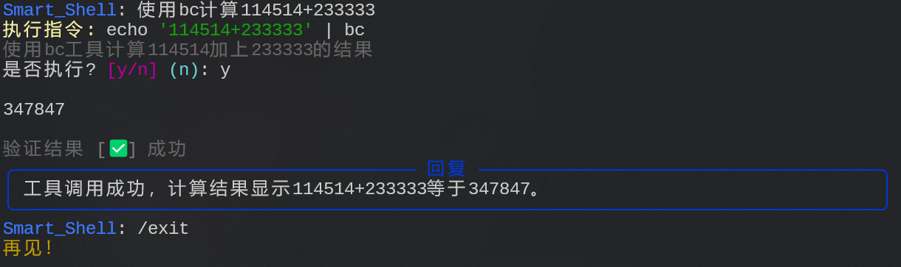

# DIY Your AI Agent: 基于大模型的智能终端助手

> 使用MCP实现的AI Agent: [MCP Agent Demo](https://github.com/whitejoce/mcp_agent)

## 🔥 项目简介  

本项目是一个 **基于大模型（LLM）的终端智能助手（Linux Agent）**，能够自动分析用户输入，判断是否需要执行终端命令，并以 **JSON 格式** 返回结果。



---

## 📖 原理解析  

### 核心设计思路

本项目采用 **上下文管理 + 状态机 + Judge Agent** 的架构设计，实现智能的命令解析与执行：
> 查看Prompt设计细节: [`prompt.md`](./docs/prompt_CN.md)
1. **规则约束与交互设计**  
   - 通过预定义规则（如严格的 JSON 输出格式）确保 LLM 响应的可解析性  
   - 特殊指令处理：目录切换统一使用 `/cd <path>` 指令，保证会话状态一致性  

2. **上下文管理**  
   - 维护 `SessionContext` 记录当前工作目录、历史命令等会话信息  
   - 将系统环境信息注入 Prompt，帮助模型更准确地理解执行上下文  

3. **终端命令执行**  
   - 使用 `subprocess.Popen()` 在真实 Shell 环境中执行命令  
   - 捕获标准输出/错误流，并实时返回执行结果  

4. **Judge Agent 结果校验**  
   - 命令执行后，调用 `check_result()` 让 LLM 作为"裁判"分析输出  
   - 自动判断命令是否成功、是否需要进一步操作，形成闭环反馈   

> 最小可行代码: 可以查看 [agent_mvp.py](./agent_mvp.py) , 浏览精简版代码。

---

## 🚀 快速开始  

### 环境准备  

需要 **Python 3.8+**，并安装 `OpenAI` 和 `rich` (富文本)库：  

```bash
pip install -r requirements.txt
```

### 配置 API

在 `agent.py` 中，通过 `Agent.API_SLOTS` 维护多组模型配置。
请根据实际情况修改：  

```python
Agent.API_SLOTS = {
   "openai": {
      "url": "https://api.openai.com/v1",
      "api_key": "your_api_key",
      "model": "gpt-4o",
   },
   # ...
}

agent = Agent(api_slot_name="openai")  # 或切换为你的自定义槽位
```

> **注意**：请确保所选槽位中的 `url` 和 `api_key` 已正确填写；可自定义新增模型配置。  

---

## 💡 如何做得更好？  

如果你想让这个 Agent 更加智能和强大，可以尝试以下几种方式：  

1️⃣ *Ask the Friendly AI* 🤖  
   - 了解[Cursor](https://cursor.com/)、[Claude Code](https://claude.com/product/claude-code)的实现原理 
   - 你可以向它提问：“如何优化我的终端助手？” 
   *SEE ALSO*: 
      - 检索增强生成（RAG）、向量数据库
      - 提示词工程 vs 上下文工程
      - Multi-Agent, `A2A协议` : `agent.json`
      - `Funtion Calling`、约束输出、SFT微调

2️⃣ **上下文管理** 📚  
   - 让 Agent 记住更多上下文信息，**持久化**之前的命令历史、用户偏好等。  
   - 在`SessionContext`中添加更多信息，让模型更好地理解当前系统环境。

3️⃣ **Model Context Protocol** 🏗️  
   - MCP（Model Context Protocol）是一种开放协议，旨在实现大型语言模型（LLM）与外部数据源和工具的无缝集成。
   - 通过标准化AI系统与数据源的交互方式，MCP帮助模型获取更丰富的上下文信息，从而生成更准确、更相关的响应。
   - 你可以参考 [MCP官方文档](https://modelcontextprotocol.io/introduction), [FastMCP](https://gofastmcp.com/getting-started/welcome) 来了解MCP的概念和应用。 

这些改进方向，可以让你的 AI 终端助手不仅仅是一个“命令解析器”，而是一个真正具备智能性的 Agent！💡✨

---

## 📜 License  

本项目采用 **MIT 许可证**，欢迎自由修改和使用！  

## 🤝 贡献  

欢迎 Issue & PR！如果你有更好的想法，欢迎贡献代码！  
